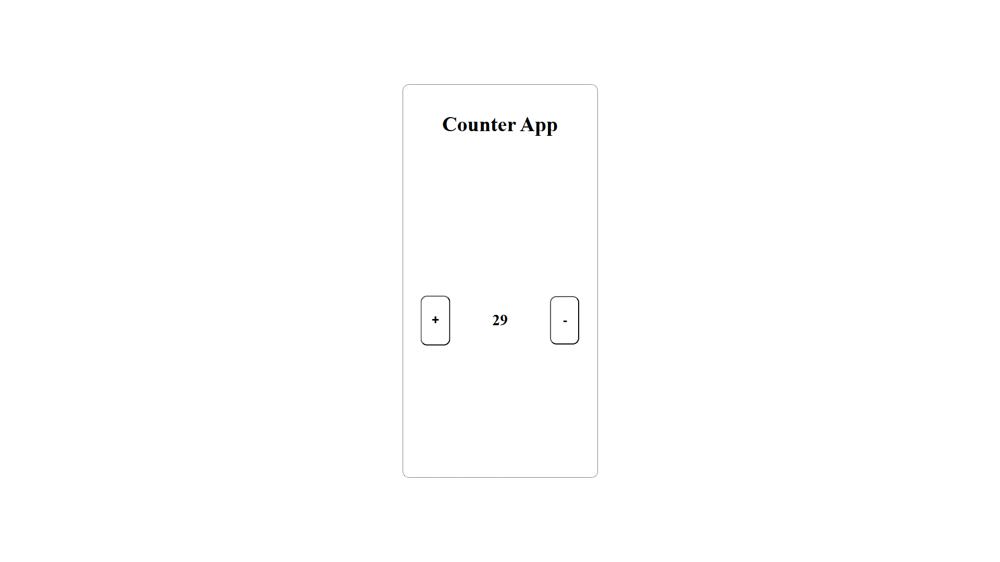
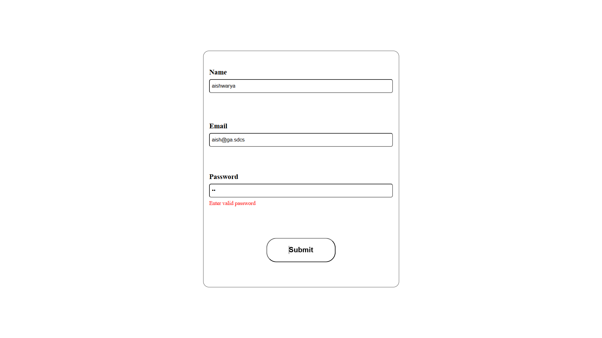

# React Projects
Here, i am maintaining this repo for my practice react projects (hope there would me no abondoned one)

## 1. Counter App
Simple counter app, uses useState hook to update count in a functional component, applied CSS made it responsive
and value does not go below 0 .. ever.. very fancy, this project might take me to google ( ◡̀_◡́)ᕤ (currently unemployed TT)

## 2. Form 
Simple Login Form with fields - name, email and passowrd, with regex validation for each field but... the code for each field seems redundant need to make that thing dynamic, followed in next project.

